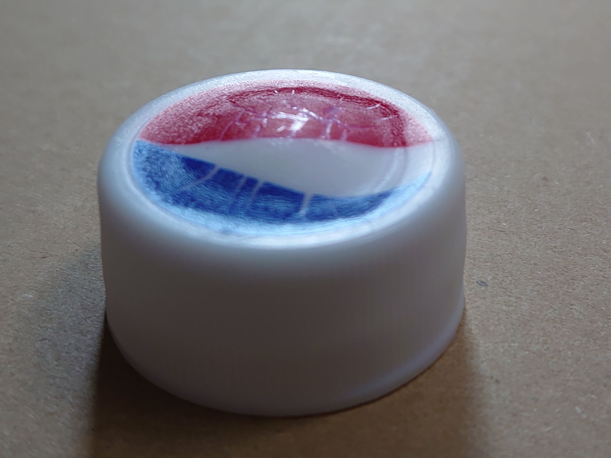
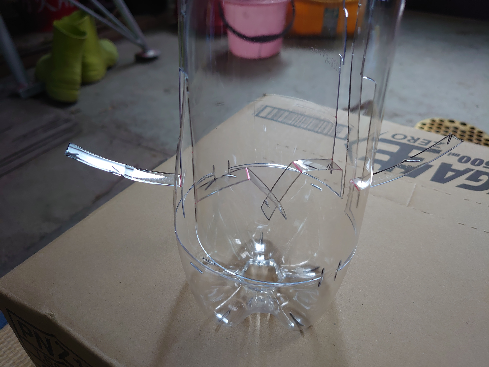
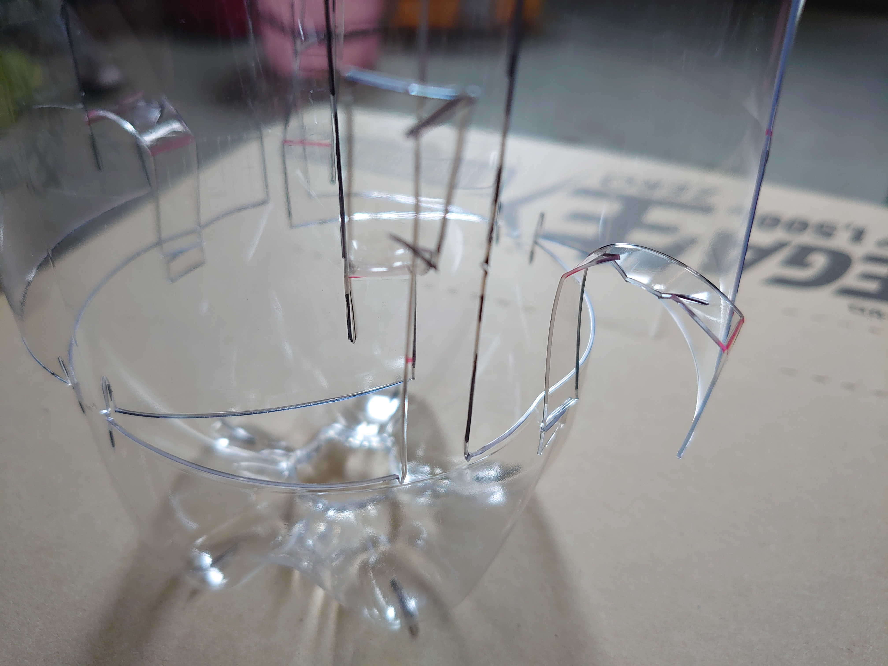
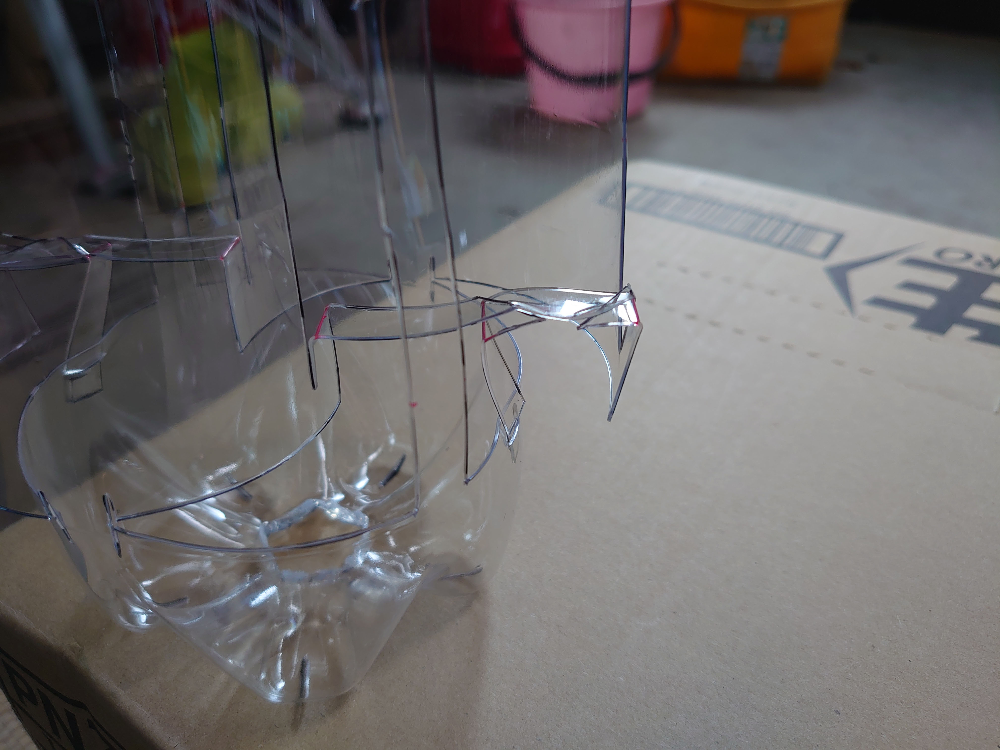
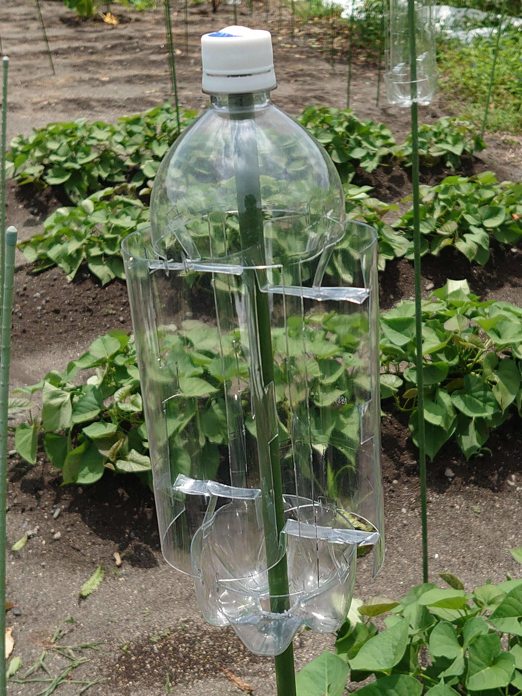

# モグラ除け用サボニウス型PETボトル風車
# Mole repellent savonius style PET bottle windmill 

畑のモグラ除け用に自作したPETボトル風車です。

よくある「プロペラ型」のモグラ除け風車は、ネット上の前例情報も多く、加工が容易ですが

+ 風向によっては回らない
+ 風が弱いと回らない
+ 風が強いと回転数が上がりすぎて破損する（羽根形状にもよるが周速比は概ね３倍を超える）

というマイナス面があり、弱風時や長期の使用に不向きでした。

風車の種類を調べたところ「サボニウス型」風車はプロペラ型風車に比べて以下の特徴があります。

+ 弱い風でも回る
+ 風向の影響を受けにくい
+ 風が強くても回転数が上がりすぎない（周速比は概ね１倍）

これらの特徴が畑でのモグラ除けに好適と考え、サボニウス型の風車を設計しました。

設計と修正を繰り返して、

+ 切断線は直線（加工手数の削減）
+ 折曲線を少なく（加工手数の削減）
+ 接着剤を使用せずに組立て（組立時の接着剤の硬化待ち時間を削減＆廃棄時の分別が容易）
+ ボトル底の軸を通す穴を５角形とし、回転によりカタカタと振動（モグラ除け効果）
+ ボトル底に水抜き穴（水溜りによる集光レンズ効果による周辺過熱を予防）
+ ボトルキャップをドーム型に加工（軸ブレによる始動性低下や回転安定性低下を抑制）

という工夫をしました。

# 動画
https://github.com/usk-johnny-s/PET_bottle_Savonius_windmill/assets/24382130/76af4bbf-c808-4e94-99b8-285c4b462b80

# ステンシル図面
[ステンシルpdf](./Stencil_SavoniusWindmill_V5.pdf)

ステンシルのCAD図面を修正する場合は下記rsdocxを参照してください。 
[ステンシルrsdocx](./SavoniusWindmill_V5_D90H320OF29.rsdocx) 
2D-CADとしてDesignSparkMechanical(v6.0.2)を使用しました。 
https://www.rs-online.com/designspark/mechanical-download-and-installation-jp

# モグラ除け効果
この風車を設置したイボ竹から周囲1～2mを避けるようにモグラの穴が作られていました。

作成数が少なかった最初の頃に圃場を囲う境界線状に設置したのですが、境界線を超えて侵入したモグラが囲いを避けながら迷走し逆効果でした。 
圃場境界線に設置するのではなく、風車による忌避範囲で圃場全体を覆うようにに設置するのが良いようです。

また500mLの炭酸飲料PETボトルでも試作してみましたが500mLはボトルが軽いため振動が弱くなります。最近はボトル質量を考えて1.5Lで作成しています。

# カラス除けには不適
カラス除けの効果を期待して、羽根の表面に反射テープやホログラムテープを貼ってみました。
設置当初は警戒して遠目で見ていたカラス達ですが、設置から２～３週で慣れてしまい忌避効果は長続きしませんでした。

最近はカラス除け効果を諦めて、反射材は貼らずに透明なボトルのままとしています。

# 素材
+ 1.5Lの炭酸飲料PETボトル（寸胴な形のもの） 
有名ブランドの腰のくびれの有るものは加工に適しません。
+ イボ竹 
太さは8mm程度、回転しやすいように両端に膨らみがないストレートな形状、片端が尖っているものが良い。 
Φ8mm-L900mm https://www.monotaro.com/p/8950/7187/

# 加工道具
参考として私の使用している道具の販売元や型番を記載しますが、目的の加工が行えれば何でも良いです。
+ A3サイズの厚口透明フィルム 
    （FOLEX：IJF-5A3C： https://www.yodobashi.com/product/100000001001118239 ） 
    これに図面を印刷して、太線を切り込んでステンシルを作ります。 
    本件図面はステンシル（型紙）です。（立体構造の図面ではありません。） 
    本件図面の長い線や周回する線にはブリッジを付加しています。 
+ ホビー用の超音波カッター 
    （ごんた屋：NH7603： https://www.amazon.co.jp/dp/B08PZ7SM2Z ） 
    PETボトルは意外に硬いのでカッターナイフでは怪我の危険があります。底は厚く硬いのでナイフでは切れません。 
    ホットナイフでPETボトルは切れるのですが、熱量が大きい物だと薄い部分を切る際に周辺の変形が発生し、熱量の小さい物だと底の厚く硬い部分が切れません。 
    試行錯誤の末にホビー用の超音波カッターに辿り着きました。 
+ ペットボトルのネジ部分を切り取ったもの 
    ボトルキャップをドーム型に加工する際の、試験管の位置決めジグです。 
+ 外径21mmの試験管 
    （新潟精機：TT21： https://www.amazon.co.jp/dp/B00432SY22 ） 
    ボトルキャップをドーム型に加工する際に、キャップを内側から押すのに使用します。 
+ 小型の片手鍋 
    （ 使用中のものは古く、現在取り扱い無しのため、類似品のリンク：https://www.amazon.co.jp/dp/B09JVSR63X ） 
    ボトルキャップをドーム型に加工する際、キャップを熱湯で加温するのに使用します。 

# 加工手順
1. キャップのドーム加工 
    熱湯を扱うので、耐熱防水手袋を使うと安全性が高まります。 
    ジグは過熱冷却で収縮するが、軽度の変形なら再利用できる。
   1. 片手鍋に水を張り火にかけ沸騰させ、弱火で沸騰を維持する。
   1. キャップを位置決めジグにねじ込み、試験管を位置決めジグに差し込む。
   1. この「キャップ・ジグ・試験管」を熱湯に入れ、キャップ部を15～50秒加温してキャップを柔らかくする。
   1. 「キャップ・ジグ・試験管」を熱湯から取出して、キャップの縁を押さえながらキャップ平坦部を試験管に押し当ててドーム状に変形させ、流水で急冷する。 
    
1. ボトルの加工 
    ボトルは加工前にラベルを剥がして、洗浄しておきます。
    1. 加工線の転写 
        1. 型紙（ステンシル）を1.5LのPETボトルに巻き付けます。
        1. 型紙底部の放射状の切断線がPETボトル底の平坦部（高台）に来るように位置合わせをします。
        1. 切断線と折曲線を書き写します。 
        （底面の切断線も忘れずに書き写します。）
    1. 切断線で切断加工 
        切断線に超音波カッターを当てて切断します。 
        腕部の斜めの切込みと、ボトル側面の上下にある水平の短い切込みは、勘合構造および差込み構造なので、出来るだけ正確に切込みます。 
        底部（５角形の切込み部）は厚いので、ゆっくりと加工します。（側面のように簡単に切れません。）
    1. 折曲線で曲げ加工 
        折曲線が１か所の腕（以下、腕Ａと呼称）が上下各２本で４本、 
        折曲線が２か所の腕（以下、腕Ｂと呼称）が上下各２本で４本あります。
         
        1. 腕Ａ（折曲線が１か所の腕）をボトル表面から見て谷折りに折り曲げます。 
        （腕Ａがボトルの外側に出っ張る形にする）
        1. 腕Ｂ（折曲線が２か所の腕）の折曲線２か所ともボトル表面から見て山折りに折り曲げます。 
        （腕Ｂがボトルの内壁側に折り込む形にする）
    1. 羽根を広げ、腕を固定 
        1. （羽根を外に押し広げる形で）腕Ａの先端部の切り込みを、ボトル側面の水平の短い切込みに差し込んで固定します。（腕Ａの４箇所とも） 
         
        1. （羽根を内に押し込む形で）腕Ｂのハの字の切り込みを、腕Ａのハの字の切り込みに差し込んで固定します。（腕Ｂの４箇所とも）
         
1. ドーム加工したキャップを取り付け

1. 設置 
    モグラの接近を避けたい場所に設置します。 
    モグラ忌避効果は設置場所から1～2ｍとお考え下さい。 
    （広い範囲の場合は面でカバーするように追加設置してください。）
    1. イボ竹の尖ったほうを上にして地面に立てる
    1. ボトル底の穴にイボ竹の尖ったほうを入れ、キャップにあたるまで差し込む。 
    ボトルの硬さ次第で腕の変位が異なります。 
    羽根がイボ竹に触れる場合は、現場合わせで（羽根を少し切り込んで）調節してください。 

